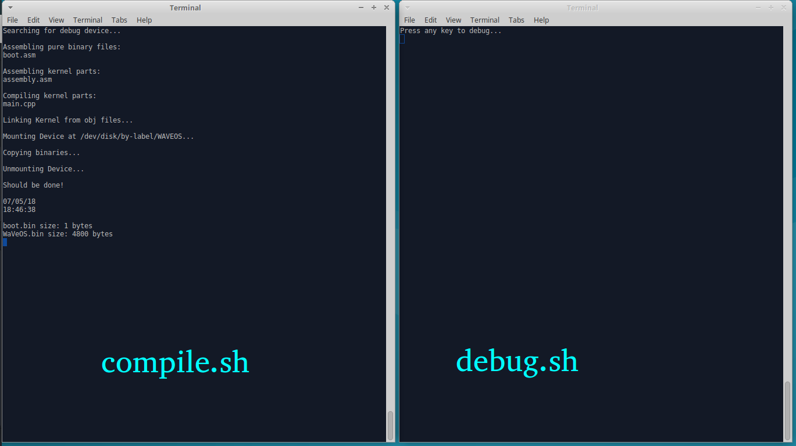

# WaVeOs32
An attempt of making my own x86 operating system

## Framework

My compiling/debugging framework consists of:
1. compile.sh

 A shell script which compiles/assembles and all source files, mounts partition of boot device(pendrive/HDD/file) and copies ready binary executables to this device. It does all of this automatically when any of source files are edited/added. Just run it in the background, and you'll have freshly compiled files on your boot device. **If you want to use it - just change boot partiton name inside the script.**

2. debug.sh

 Another shell script. It searches for boot device(whole boot device, not just a partition) and waits for user input. every time you press a key "on this script", it runs a BOCHS debug simulation. **Also, if you want to use this script, just change boot device name inside the script.**

3. bochs.conf

 BOCHS's configuration file. It defines how "virtual PC" works. For example - what kind of cpu it should emulate, how much memory should "virtual PC" have... **So, once again - if you want to use my bochs.conf, all you have to do is to change path to your boot device.**

I personally run compile.sh and debug.sh at the same time. compile.sh automatically compiles my code in the background, and when I want to try out how my OS behaves I just run Bochs simulation from debug.sh

**And obviously, these scripts have to be ran as root (i.e sudo)**

## Boot process

  1. #### Bootsector

   I use [my own FAT32 Bootsector](https://github.com/TebexPL/FAT32-Bootsector), which loads proper Bootloader from boot partition. It occupies first 446 bytes of boot device. All it does:
    1. Search for specified file on boot partition(FAT32)
    2. Load this file into memory
    3. Execute it

  2. #### "Proper Bootloader"...   (not complete yet)
   ...Is just a pure binary executable. All it does:
   1. Load Kernel into memory(.elf file)
   2. Set the environment for Kernel(a20 gate, protected mode...)
   3. Jump to kernel

   **Important note: my "proper bootloader" needs my FAT32 bootsector, because bootsector leaves some data which is used by "bootloader proper"**

  3. #### Kernel
  Nothing to write here. Kernel is just the end of boot process.

## Is that all?
  I'll add more info as development moves forward.
